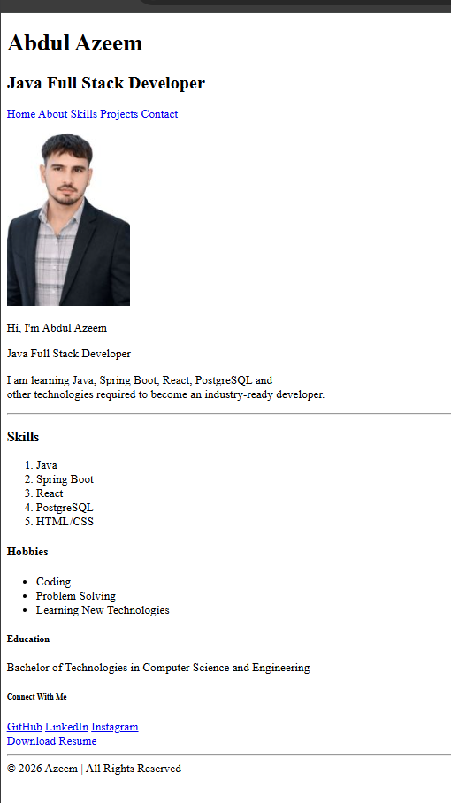

# 📄 Personal Resume Page

A simple and beginner-friendly **Personal Resume Web Page** created using **HTML5**.

This project is built to practice semantic HTML elements, headings, paragraphs, images, lists, links, and the HTML download attribute.

## 🌐 Live Preview

You can open the `index.html` file in any modern web browser to view the resume page.

---

## 📌 Features

* 👤 Personal profile section
* 💼 Java Full Stack Developer introduction
* 🖼️ Profile image
* 🛠️ Skills section
* 🎯 Hobbies section
* 🎓 Education section
* 🔗 GitHub and LinkedIn links
* 📄 Resume download option
* 🧭 Navigation menu
* 🏷️ Semantic HTML5 elements
* 📱 Basic responsive viewport setup

---

## 🧠 HTML Concepts Used

This project was created to practice the following HTML concepts:

### Semantic Elements

```html
<header>
<nav>
<main>
<section>
<footer>
```

### Heading Elements

```html
<h1>
<h2>
<h3>
<h4>
<h5>
<h6>
```

### Other HTML Elements

* `<p>` — Paragraphs
* `` — Profile image
* `<a>` — Links
* `<ol>` — Ordered list
* `<ul>` — Unordered list
* `<li>` — List items
* `<br>` — Line break
* `<hr>` — Horizontal line

### HTML Attributes

```html
target="_blank"
```

Used to open links in a new tab.

```html
download
```

Used to download the resume PDF.

```html
alt
```

Used to provide alternative text for the image.

---

## 📂 Project Structure

```text
Resume-Page/
│
├── index.html
├── azeem1.jpg
├── Abdul_Azeem_Resume.pdf
└── README.md
```

---

## 👨‍💻 About Me

Hi, I'm **Abdul Azeem**, an aspiring **Java Full Stack Developer**.

Currently learning technologies including:

* Java
* Spring Boot
* React
* PostgreSQL
* HTML
* CSS

My goal is to become an **industry-ready Java Full Stack Developer**.

---

## 🛠️ Technologies Used

| Technology | Purpose                  |
| ---------- | ------------------------ |
| HTML5      | Structure of the webpage |
| Git        | Version control          |
| GitHub     | Code hosting             |

---

## 🚀 How to Run

### 1. Clone the repository

```bash
git clone <your-repository-url>
```

### 2. Open the project

Go to the project folder:

```bash
cd Resume-Page
```

### 3. Run the project

Simply open:

```text
index.html
```

in your browser.

---

## 📸 Project Preview





## 📚 Learning Purpose

This project is created as part of my **HTML learning journey**.

The main objective is to understand:

* Semantic HTML
* HTML document structure
* Headings
* Lists
* Images
* Hyperlinks
* HTML attributes
* Navigation
* Download links
* Basic webpage organization

---

## 🔮 Future Improvements

I plan to improve this project by adding:

* 🎨 CSS styling
* 📱 Better responsive design
* 🌙 Dark mode
* ✨ JavaScript interactions
* 📧 Contact form
* 💼 Projects section
* 🧑‍💻 More detailed skills section
* 📄 Professional resume layout

---

## 👤 Author

**Abdul Azeem**

Aspiring Java Full Stack Developer

* GitHub: [Abdul Azeem](https://github.com/abdulazeem8630)
* LinkedIn: [Abdul Azeem](https://www.linkedin.com/in/abdul-azeem-0780783a8/)

---

⭐ If you find this project useful, feel free to give it a star!
