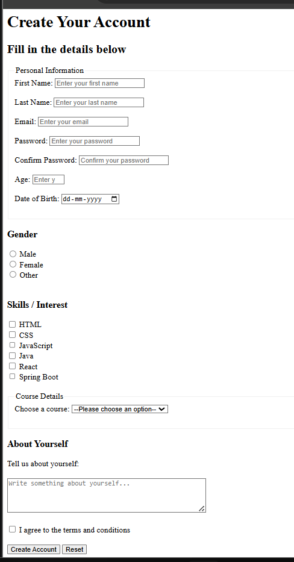

# 📝 Registration Form

A simple and beginner-friendly **Registration Form** created using **HTML5**.

This project is built to practice HTML forms, input elements, labels, validation attributes, radio buttons, checkboxes, dropdowns, fieldsets, legends, textarea, and form submission.

---

## 📌 Features

- 👤 First Name and Last Name
- 📧 Email
- 🔐 Password and Confirm Password
- 🔢 Age
- 📅 Date of Birth
- ⚧️ Gender Selection
- 🛠️ Skills / Interests
- 📚 Course Selection
- 📂 Frontend and Backend categories
- 📝 About Yourself
- ✅ Terms and Conditions
- 🚀 Create Account button
- 🔄 Reset button
- ✔️ HTML5 Form Validation

---

## 🧠 HTML Concepts Used

### Semantic Elements

```html
<header>
<main>
<section>
````

### Form Elements

```html
<form>
<label>
<input>
<select>
<option>
<optgroup>
<textarea>
<button>
```

### Input Types

```html
text
email
password
number
date
radio
checkbox
submit
reset
```

---

## ✅ Form Validation

The project uses built-in HTML5 validation attributes.

* `required` — Makes a field mandatory
* `pattern` — Defines a specific input pattern
* `minlength` — Sets minimum character length
* `min` — Sets minimum numeric value
* `max` — Sets maximum numeric value
* `placeholder` — Displays a hint inside the input

Example:

```html
<input
    type="text"
    name="firstName"
    placeholder="Enter your first name"
    pattern="[A-Za-z ]{3,}"
    required
>
```

---

## 📂 Fieldset and Legend

`<fieldset>` is used to group related form fields, while `<legend>` provides a title for the group.

### Personal Information

```html
<fieldset>
    <legend>Personal Information</legend>
</fieldset>
```

### Course Details

```html
<fieldset>
    <legend>Course Details</legend>
</fieldset>
```

---

## 📚 Course Dropdown

The course selection uses `<select>`, `<option>` and `<optgroup>`.

```html
<select>
    <optgroup label="Frontend">
        <option>HTML</option>
        <option>CSS</option>
        <option>JavaScript</option>
        <option>React</option>
    </optgroup>

    <optgroup label="Backend">
        <option>Java</option>
        <option>Spring Boot</option>
        <option>PostgreSQL</option>
    </optgroup>
</select>
```

---

## 📂 Project Structure

```text
Registration-Form/
│
├── index.html
├── img.png
└── README.md
```

---

## 🛠️ Technologies Used

| Technology | Purpose                     |
| ---------- | --------------------------- |
| HTML5      | Structure and form creation |
| Git        | Version control             |
| GitHub     | Code hosting                |

---

## 🚀 How to Run

### 1. Clone the repository

```bash
git clone <your-repository-url>
```

### 2. Open the project folder

```bash
cd Registration-Form
```

### 3. Run the project

Open `index.html` in any modern web browser.

---

## 📸 Project Preview



---

## 📚 Learning Purpose

This project is created as part of my **HTML learning journey**.

The main objective is to understand:

* HTML Forms
* Input Types
* Labels
* Radio Buttons
* Checkboxes
* Select Dropdowns
* Option Groups
* Textarea
* Fieldset and Legend
* Form Validation
* Required Fields
* Pattern Validation
* Min/Max Validation
* Submit and Reset Buttons
* Semantic HTML

---

## 🔮 Future Improvements

* 🎨 Add CSS styling
* 📱 Make the form fully responsive
* ✨ Add JavaScript validation
* 🔐 Add password matching validation
* 💾 Connect the form with a backend
* 🗄️ Store registration data in a database
* 💬 Add better validation messages
* 🎯 Show success message after registration

---

## 👤 Author

**Abdul Azeem**

Aspiring **Java Full Stack Developer**

* GitHub: [Abdul Azeem](https://github.com/abdulazeem8630)
* LinkedIn: [Abdul Azeem](https://www.linkedin.com/in/abdul-azeem-0780783a8/)

---

⭐ If you find this project useful, feel free to give it a star!

```
