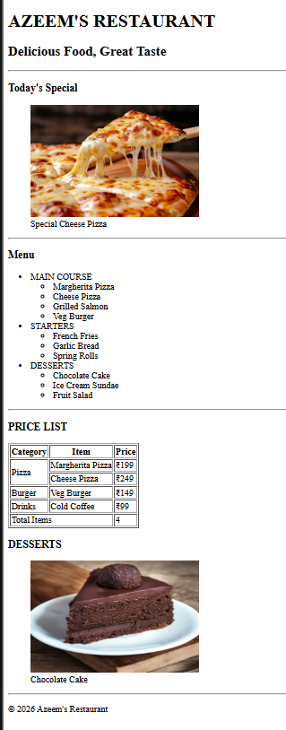

# 🍽️ Azeem's Restaurant

A simple and beginner-friendly **Restaurant Web Page** created using **HTML5**.

This project is built to practice semantic HTML, images, lists, tables, figures, captions, and structured webpage layout.

---

## 📌 Features

- 🍕 Today's Special section
- 🖼️ Food images with captions
- 📋 Restaurant menu
- 🍔 Main Course section
- 🥖 Starters section
- 🍰 Desserts section
- 💰 Price List table
- 💵 Prices displayed in Indian Rupees
- 📊 Table using `rowspan` and `colspan`
- 🧾 Table header, body and footer
- 🏷️ Semantic HTML5 structure

---

## 🧠 HTML Concepts Used

### Semantic Elements

```html
<header>
<main>
<section>
<footer>
Image and Figure Elements
<figure>

<figcaption>

These elements are used to display food images along with their captions.

List Elements
<ul>
<li>

Nested unordered lists are used to organize the restaurant menu into categories.

Table Elements
<table>
<thead>
<tbody>
<tfoot>
<tr>
<th>
<td>

The table is used to display the restaurant's price list.

📊 Table Concepts Used
rowspan

Used to combine multiple rows.

<td rowspan="2">Pizza</td>

The Pizza category covers two rows.

colspan

Used to combine multiple columns.

<td colspan="2">Total Items</td>

The Total Items cell covers two columns.

📂 Project Structure
Restaurant-Page/
│
├── index.html
├── pizza.jpg
├── cake.avif
└── README.md
🛠️ Technologies Used
Technology	Purpose
HTML5	Structure of the webpage
Git	Version control
GitHub	Code hosting
🍽️ Menu
Main Course
Margherita Pizza
Cheese Pizza
Grilled Salmon
Veg Burger
Starters
French Fries
Garlic Bread
Spring Rolls
Desserts
Chocolate Cake
Ice Cream Sundae
Fruit Salad
💰 Price List
Category	Item	Price
Pizza	Margherita Pizza	₹199
Pizza	Cheese Pizza	₹249
Burger	Veg Burger	₹149
Drinks	Cold Coffee	₹99
🚀 How to Run
1. Clone the repository
git clone <your-repository-url>
2. Open the project folder
cd Restaurant-Page
3. Run the project

Open index.html in any modern web browser.

📸 Project Preview


📚 Learning Purpose

This project is created as part of my HTML learning journey.

The main objective is to understand:

Semantic HTML
Headings
Paragraphs
Images
Figure and Figcaption
Unordered Lists
Nested Lists
Tables
Table Head
Table Body
Table Footer
rowspan
colspan
Horizontal Rules
Basic webpage structure
🔮 Future Improvements
🎨 Add CSS styling
📱 Make the page responsive
🖼️ Improve food image layout
🛒 Add online ordering
📋 Add a complete menu
📞 Add contact information
📍 Add restaurant location
✨ Add JavaScript interactions
💳 Add online payment functionality
👤 Author

Abdul Azeem

Aspiring Java Full Stack Developer

GitHub: Abdul Azeem
LinkedIn: Abdul Azeem

⭐ If you find this project useful, feel free to give it a star!