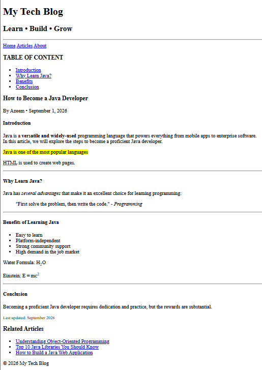

# 📝 My Tech Blog - Blog Article Page

A simple and beginner-friendly **Blog Article Web Page** created using **HTML5**.

This project is built to practice semantic HTML, text formatting, internal navigation, lists, blockquotes, citations, and basic webpage structure.

---

## 📌 Features

- 📝 Blog Article Page
- 🧭 Navigation bar
- 📑 Table of Contents
- 🔗 Internal page navigation using `id` and `#`
- 📖 Article sections
- 💡 Introduction section
- ☕ Why Learn Java section
- 🚀 Benefits of Learning Java section
- 🎯 Conclusion section
- 📚 Related Articles sidebar
- ✍️ Author and publication date
- 🖊️ Text formatting using `strong` and `em`
- 🖍️ Highlighted text using `mark`
- 🏷️ Abbreviation using `abbr`
- 💬 Quote using `blockquote`
- 📌 Citation using `cite`
- 💧 Subscript using `sub`
- ⚡ Superscript using `sup`
- 🔎 Small text using `small`
- ➖ Horizontal section breaks using `hr`
- 🏷️ Semantic HTML5 structure

---

## 🧠 HTML Concepts Used

### Semantic Elements

```html
<header>
<nav>
<main>
<section>
<article>
<aside>
<footer>
```

These semantic elements are used to create a meaningful and well-structured webpage.

### Text Formatting Elements

```html
<strong>
<em>
<mark>
<small>
```

These elements are used to emphasize, highlight, and format important text.

### Abbreviation

```html
<abbr title="HyperText Markup Language">HTML</abbr>
```

The `abbr` element is used to represent an abbreviation with additional information available through the `title` attribute.

### Blockquote and Citation

```html
<blockquote>
<cite>
```

`blockquote` is used to display a quotation.

`cite` is used to identify the source or reference of the quotation.

### Subscript and Superscript

```html
<sub>
<sup>
```

Examples:

```html
H<sub>2</sub>O
```

```html
E = mc<sup>2</sup>
```

---

## 🔗 Internal Navigation

The project uses `id` attributes and anchor links to navigate between different sections of the article.

Example:

```html
<a href="#introduction">Introduction</a>
```

```html
<section id="introduction">
```

This allows users to click an item in the Table of Contents and jump directly to the required section.

---

## 📚 Table of Contents

The blog contains the following sections:

- Introduction
- Why Learn Java?
- Benefits of Learning Java
- Conclusion

---

## 📰 Blog Content

### Introduction

The introduction explains what Java is and why it is a popular programming language.

### Why Learn Java?

This section explains some advantages of learning Java and includes a programming-related quotation.

### Benefits of Learning Java

The article covers benefits such as:

- Easy to learn
- Platform-independent
- Strong community support
- High demand in the job market

### Conclusion

The conclusion explains the importance of dedication and practice while learning Java.

---

## 📂 Project Structure

```text
Blog-Article-Page/
│
├── index.html
└── README.md
```

---

## 🛠️ Technologies Used

| Technology | Purpose |
|---|---|
| HTML5 | Structure of the webpage |
| Git | Version control |
| GitHub | Code hosting |

---

## 🚀 How to Run

### 1. Clone the Repository

```bash
git clone <your-repository-url>
```

### 2. Open the Project Folder

```bash
cd Blog-Article-Page
```

### 3. Run the Project

Open `index.html` in any modern web browser.

---

## 📸 Project Preview

Add your screenshot here:



> Make sure your screenshot file is named `img.png` and is present in the project folder.

---

## 📚 Learning Purpose

This project is created as part of my **HTML learning journey**.

The main objective is to understand and practice:

- Semantic HTML
- Headings
- Paragraphs
- Articles
- Sections
- Navigation
- Aside
- Footer
- Internal Links
- `id`
- `strong`
- `em`
- `mark`
- `small`
- `abbr`
- `blockquote`
- `cite`
- `sub`
- `sup`
- `hr`
- Unordered Lists
- Basic webpage structure

---

## 🔮 Future Improvements

- 🎨 Add CSS styling
- 📱 Make the page responsive
- 🖼️ Add featured images
- 🔍 Add search functionality
- 📚 Add more blog articles
- 💬 Add comments section
- ❤️ Add Like/Share buttons
- 🧭 Improve navigation
- ✨ Add JavaScript interactions
- 🌙 Add Dark Mode

---

## 👤 Author

**Abdul Azeem**

Aspiring Java Full Stack Developer

### 🔗 Connect With Me

**GitHub:** [Abdul Azeem](https://github.com/abdulazeem8630)

**LinkedIn:** [Abdul Azeem](https://www.linkedin.com/in/abdul-azeem-0780783a8/)

---

⭐ If you find this project useful, feel free to give it a star!