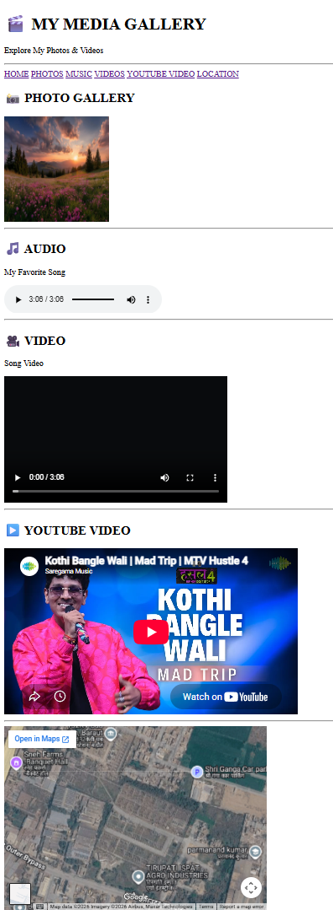

# 🎬 My Media Gallery

A simple and beginner-friendly **Multimedia Gallery Web Page** created using **HTML5**.

This project is built to practice responsive images, audio, video, YouTube embedding, Google Maps embedding, navigation, and semantic webpage structure.

---

## 📌 Features

- 🖼️ Photo Gallery
- 📱 Responsive images using `srcset`
- 🎵 Audio player with controls
- 🎥 Video player with controls
- ▶️ Embedded YouTube video
- 📍 Embedded Google Maps location
- 🧭 Navigation menu
- 🔗 Internal page navigation using `id` and `#`
- 🏷️ Semantic HTML5 structure
- 📐 Viewport meta tag for responsive webpages
- 📝 Image `alt` attribute for accessibility
- 🎞️ Multiple media formats

---

## 🧠 HTML Concepts Used

### Semantic Elements

```html
<header>
<nav>
<main>
<section>
<footer>
```

These semantic elements are used to create a meaningful and well-structured webpage.

---

### Image Element

```html

```

The `` element is used to display images on the webpage.

The `alt` attribute provides alternative text for the image.

---

### Responsive Images

```html
srcset="college.avif 480w, city.avif 800w, nature.jpg 1200w"
```

The `srcset` attribute provides multiple image options for different screen sizes and resolutions.

---

## 🎵 Audio Element

```html
<audio controls>
  <source src="song.mp3" type="audio/mpeg" />
</audio>
```

The `<audio>` element is used to add an audio player to the webpage.

The `controls` attribute provides playback controls such as play, pause, and volume.

---

## 🎥 Video Element

```html
<video controls>
  <source src="video.mp4" />
</video>
```

The `<video>` element is used to display video content.

The `controls` attribute allows users to control video playback.

---

## ▶️ YouTube Video

The project uses an `<iframe>` to embed a YouTube video directly into the webpage.

```html
<iframe
  width="560"
  height="315"
  src="https://www.youtube.com/embed/"
  allowfullscreen
></iframe>
```

This allows external YouTube content to be displayed inside the webpage.

---

## 📍 Google Maps

A Google Maps location is embedded using an `<iframe>`.

```html
<iframe
  src="https://www.google.com/maps/embed"
  width="500"
  height="350"
  allowfullscreen
  loading="lazy"
></iframe>
```

The `loading="lazy"` attribute helps delay loading the map until it is needed.

---

## 🔗 Internal Navigation

The project uses `id` attributes and anchor links to navigate between different sections.

Example:

```html
<a href="#photos">PHOTOS</a>
```

```html
<section id="photos">
```

This allows users to click a navigation link and jump directly to the required section.

---

## 📂 Project Structure

```text
Multimedia-Gallery/
│
├── index.html
├── college.avif
├── city.avif
├── nature.jpg
├── song.mp3
├── video.mp4
├── img.png
└── README.md
```

> Make sure the filenames in your project folder match the filenames used in `index.html`.

---

## 🛠️ Technologies Used

| Technology | Purpose |
|---|---|
| HTML5 | Structure of the webpage |
| Git | Version control |
| GitHub | Code hosting |
| YouTube Embed | Embedded video |
| Google Maps Embed | Embedded location |

---

## 🎞️ Media Used

### 📸 Photos

- College Image
- City Image
- Nature Image

### 🎵 Audio

- Favorite Song

### 🎥 Video

- Song Video

### ▶️ YouTube

- Embedded YouTube Video

### 📍 Location

- Embedded Google Maps

---

## 🚀 How to Run

### 1. Clone the Repository

```bash
git clone <your-repository-url>
```

### 2. Open the Project Folder

```bash
cd Multimedia-Gallery
```

### 3. Run the Project

Open `index.html` in any modern web browser.

---

## 📸 Project Preview



> Make sure your screenshot file is named `img.png` and is present in the project folder.

---

## 📚 Learning Purpose

This project is created as part of my **HTML learning journey**.

The main objective is to understand and practice:

- HTML5
- Semantic HTML
- Headings
- Paragraphs
- Navigation
- Internal Links
- Images
- `src`
- `srcset`
- `alt`
- Audio
- Video
- `source`
- `iframe`
- YouTube Embedding
- Google Maps Embedding
- `controls`
- `allowfullscreen`
- `loading="lazy"`
- `referrerpolicy`
- Basic webpage structure

---

## 🔮 Future Improvements

- 🎨 Add CSS styling
- 📱 Make the gallery fully responsive
- 🖼️ Add multiple photos
- 🔍 Add image preview/lightbox
- 🎵 Add multiple songs
- 🎥 Add multiple videos
- ▶️ Add more YouTube videos
- 📍 Add multiple locations
- ✨ Add JavaScript interactions
- 🌙 Add Dark Mode
- 🗂️ Add media categories and filters

---

## 👤 Author

**Abdul Azeem**

Aspiring Java Full Stack Developer

### 🔗 Connect With Me

**GitHub:** [Abdul Azeem](https://github.com/abdulazeem8630)

**LinkedIn:** [Abdul Azeem](https://www.linkedin.com/in/abdul-azeem-0780783a8/)

---

⭐ If you find this project useful, feel free to give it a star!